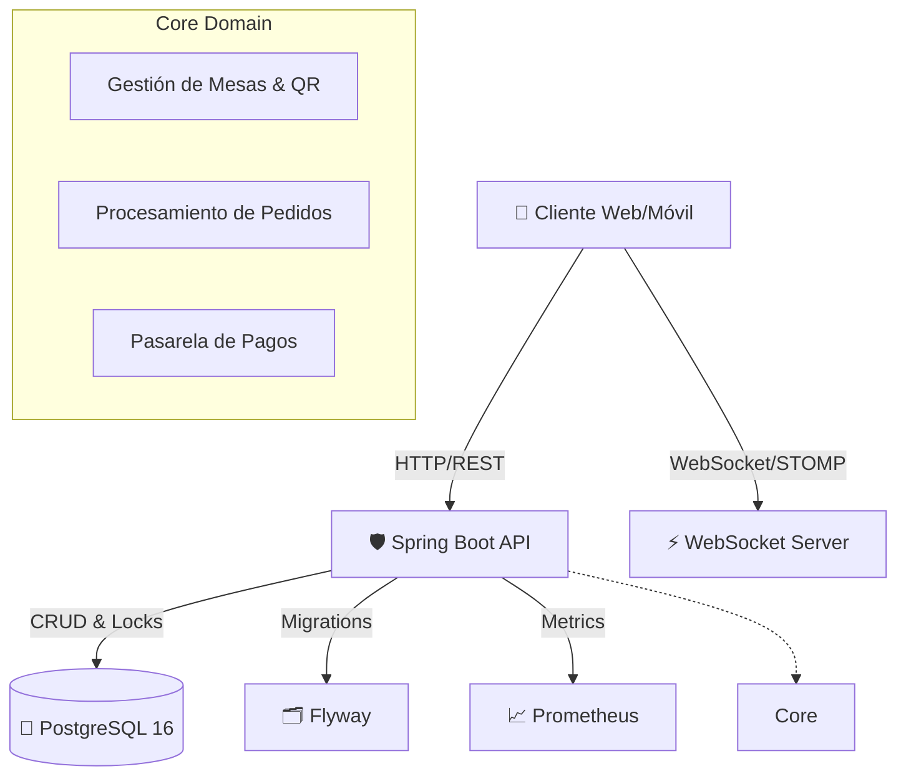

<div align="center">
  
  
  
  
  
  <br>
  <h1>🍽️ MesaQR API</h1>
  <p><strong>Plataforma Enterprise de Gestión y Autopedidos para Restaurantes</strong></p>
  <p>Elimina la fricción entre el cliente y el mesero. Autogestión de pedidos en tiempo real vía códigos QR.</p>
</div>

---

## 🚀 Visión General

**MesaQR** revoluciona la experiencia gastronómica mediante la digitalización del flujo tradicional `Cliente ↔ Mesero ↔ Cocina`. Basado en una arquitectura de microservicios robusta y orientada a eventos, MesaQR permite a los comensales escanear un código QR único por mesa, realizar pedidos concurrentes en tiempo real y pagar instantáneamente, reduciendo los tiempos de espera y aumentando la rotación de mesas.

Diseñado con los más altos estándares de la industria (Enterprise-grade), garantiza alta disponibilidad, concurrencia segura mediante _Pessimistic Locking_, y observabilidad completa con Actuator y Prometheus.

## ✨ Características Principales

- 📱 **Autogestión sin fricción:** QR único de sesión (24h TTL) inyectado dinámicamente para acceso sin registro.
- ⚡ **Sincronización en Tiempo Real:** Arquitectura Event-Driven sobre WebSockets (STOMP/SockJS) para updates vivos a meseros y cocina.
- 🛡️ **Seguridad y Concurrencia:** Integración de `PESSIMISTIC_WRITE` a nivel de DB y _Resilience4j_ para manejar colisiones de múltiples comensales en una misma mesa.
- 💳 **Pagos Flexibles:** Pasarela agnóstica soportando pagos en efectivo, tarjeta (Stripe-ready), y Webhooks para transferencias asíncronas.
- 📊 **Observabilidad Integral:** Métricas en tiempo real con Spring Boot Actuator y Prometheus.
- 🐳 **Despliegue Contenerizado:** Entorno multi-stage en Docker, listo para ser orquestado en Kubernetes.

## 🏗️ Arquitectura de la Solución

MesaQR utiliza un patrón de diseño monolítico modular, preparado para escalar a microservicios.



## 🛠️ Stack Tecnológico

- **Core:** Java 21 LTS, Spring Boot 3.3.0
- **Base de Datos:** PostgreSQL 16, H2 (Testing), Flyway (Versionado de BD)
- **Comunicación:** REST API, WebSocket (STOMP)
- **Resiliencia & Observabilidad:** Resilience4j, Spring Boot Actuator, Micrometer (Prometheus)
- **Infraestructura:** Docker, Docker Compose, Maven Wrapper
- **Testing:** JUnit 5, Mockito, Testcontainers

## ⚙️ Despliegue Rápido (Quickstart)

El proyecto está preparado para funcionar de inmediato mediante Docker Compose.

### Requisitos
- **Docker & Docker Compose** (para la infraestructura de BD)
- **JDK 21** (opcional, para desarrollo local)

### Pasos

1. **Levantar la Infraestructura:**
   ```bash
   docker-compose up -d
   ```
   *Esto iniciará la base de datos PostgreSQL en el puerto 5432 y ejecutará las migraciones iniciales de Flyway.*

2. **Ejecutar la Aplicación:**
   ```bash
   ./mvnw spring-boot:run
   ```
   *La API estará disponible en `http://localhost:8080`. Se puede acceder a la UI de Swagger en `http://localhost:8080/swagger-ui.html`.*

## 🔒 Control de Concurrencia (Deep Dive)

En un entorno de restaurante, múltiples clientes en la misma mesa pueden intentar modificar el mismo pedido simultáneamente. MesaQR soluciona esto mediante:
- **Pessimistic Locking (`@Lock(PESSIMISTIC_WRITE)`)** en la capa JPA, garantizando integridad referencial.
- **Spring Retry** (Backoff exponencial) para asegurar que ninguna petición se pierda debido a locks temporales, garantizando una experiencia de usuario fluida.

## 📄 Licencia

Distribuido bajo la Licencia MIT. Ver el archivo `LICENSE` para más detalles.
